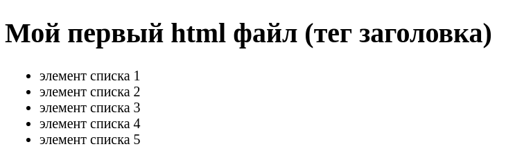

# Как начать использовать html?

## Перед прочтением нужно знать:
* что такое текстовый редактор
* html (optional)

## html файлы повсюду

Чтобы увидеть, как выглядит результат работы `html` и `css` достаточно
открыть любую страницу в браузере.

Чтобы увидеть html код страницы можно
* нажать сочетание клавиш `Ctrl + U`
* Нажать правой кнопкой мыши на странице и выбрать пункт 
_Просмотр кода страницы_

## Первый html файл

Чтобы создать свой собственный html файл нужно создать файл с **расширением**
`.html`.

Например `index.html` - отличное название для файла =)

На операционной системе Windows могут возникнуть проблемы с расширением,
так как зачастую расширение скрыто от пользователя. Чтобы оно отображалось
нужно изменить настройки отображения папок и файлов, если мне не изменяет
память. Я мог бы приложить ссылку, но ресурс однажды может устареть/ссылка 
может стать неактуальной. Поэтому воспользуйтесь гуглом, это не сложно.

Содержимое пустого html файла может выглядеть так:

```html
<!DOCTYPE html>
<html>
    <head>
    
    </head>
    <body>
    
    </body>
</html>
```

Первая директива `<!DOCTYPE html>` указывает браузеру на стандарт, в котором
описывается документ. Остальное - html теги.

Чтобы увидеть что-нибудь на странице, давайте добавим несколько тегов в 
уже написанную разметку.

```html
<!DOCTYPE html>
<html>
    <head>
        <title>Первый html файл</title>
        <meta charset="utf-8">
    </head>
    <body>
        <h1>Мой первый html файл</h1>
        
        <ul>
            <li>
                элемент списка 1
            </li>
            <li>
                элемент списка 2
            </li>
            <li>
                элемент списка 3
            </li>
            <li>
                элемент списка 4
            </li>
            <li>
                элемент списка 5
            </li>
        </ul>
    </body>
</html>
```

* Тег `title` в `head` указывает название документа, которое отображается
во вкладке.
* Тег `meta` указывает браузеру кодировку документа
* Тег `h1` - тег заголовка первого уровня
* Связка тегов `ul > li` позволяет разметить список.

Сохраните файл. Откройте его в папке и дважды кликните(или нажмите `Enter`).
Созданная вами страница должна открыться в браузере, который у вас определён
браузером по умолчанию.

Внешний вид страницы может слегка разниться от браузера к браузеру, но в
целом страница должна выглядеть примерно так:

