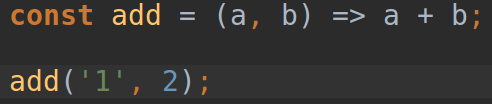
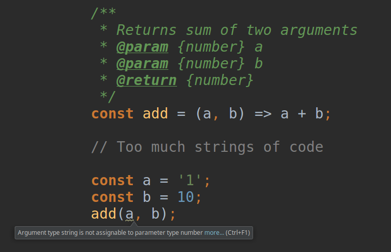
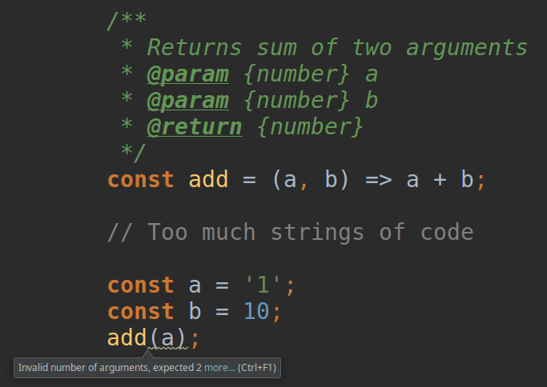

# Документирование кода

## Нужно ли документировать код?

_Быть или не..._ Эээ.. Документировать или нет? Вот в чём вопрос!

Есть разные проекты, и разные люди, которые эти проекты поддерживают. Можно встретить
такие:

_- У меня код отдокументирован по самые гланды. Каждая строка описана. Уверен, что 
никто не запутается и поддерживать мой код будет легко и мне и окружающим._

и такие:

_- Комментировать код? Да что вы себе позволяете? Мой код настолько безупречен и 
понятен, что читается без сучка без задоринки._

и такие...

_- Комментирование кода? Нет, я этим не занимаюсь. Я в проекте с самого начала, и
помню каждую строку кода, которую написал. Знаю, что делает мой код, а комментить его - 
лишняя трата времени_

высказывания.

На мой взгляд ответ однозначно - да. Вопрос в том, **как** документировать.

## Как документировать код?

Я не буду даже пытаться потягаться с опытными людьми, написавшими отличные книги на тему
тестирования, рефакторинга и вообще написания кода. Собственно и статья не совсем об этом.

Скажу лишь, что нужно найти середину между _"хороший код сам себя документирует"_ и 
_"комментируй код полностью"_. 

Комментариев должно быть очень мало потому, что хороший код действительно сам себя 
комментирует, но бывают случаи, когда вы в горячке делаете что-то крайне невразумительное, 
так как всё горит, и вы возможно, даже не понимаете как это работает и тут... Тут лучше
оставить комментарий `TODO: refactor`.

Кто-то скажет _"Ну да, конечно, а потом весь проект в таких комментариях, и никто
даже не планирует ничего рефакторить. А значит такие комментарии бесполезны!"_.

Два успокоительных укола этому сэру! 

О том, почему такие комментарии не должны плодиться
изо дня в день я напишу отдельно. Если кратко, то скорее всего проблема в том, что на
каком-то уровне хромает **планирование**: либо разработчик валяет дурака, а потом у него
реально всё горит и он пишет сам не зная что; либо бегают горящие менеджеры, которым надо
**СЕЙЧАС!**. Вариантов может быть масса.

Извините, возвращаюсь к теме. Код состоит из данных и функций, которые работают с данными.
Вот хотя бы эти самые функции нужно покрывать комментариями, но не абы какими, а в 
специальном формате.

## ESDoc

Есть инструмент - https://esdoc.org/. Он позволяет генерировать документацию по
коду, но не только.

Дело в том, что большинство редакторов кода будут уведомлять вас о том, что функция
используется не так как предполагалось, если правильно её продокументировать.

Возьмём прекрасную функцию `add`.

```javascript
const add = (a, b) => a + b;
```

Вы будете бесконечно правы, если скажете "Что тут комментировать? Тут и дураку всё понятно".

Но посмотрите вот на это:



JavaScript не будет ругаться на то, что вы передаёте строку, хотя подразумевали число.
Ошибку можно искать очень долго, особенно, если сама функция объявлена в одном месте, а
вызывается в другом, а аргументы вообще помещены в переменные, например вот так:


Теперь давайте наведём немного красоты.


Да, мы добавили многострочный комментарий. Но не совсем обычный.
Давайте разберёмся, что же мы указали.

* Описание того, что функция делает. Да-да, все видят и знают, что она 
просто складывает. Но функции могут быть более сложными, и тогда, если
оставлен хороший esdoc комментарий, вы будете трижды благодарны 
разработчику.
* Набор параметров через директиву `@param`. Здесь мы указываем тип
аргумента `{number}` (подробнее о них, в документации), а также имя
аргумента, в нашем случае `a` и `b` соответственно.
* Тип значения возвращаемого функцией через директиву `@return`.

Уверен, то, что я покажу дальше справедливо не только для редактора, в
котором работаю я.



Как видите, теперь редактор подсвечивает первый аргумент, а при наведении
мышкой сообщает, что ожидается аргумент другого типа.



Если же передать недостаточное количество аргументов, то нам об этом также сообщат.

Как видите, у нас есть ещё один способ обезопасить себя от ошибок при разработке, также
иметь возможность генерировать документацию к коду.