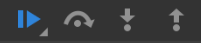

# learning-to-debug (basics)

## Введение

*Используемый браузер Google Chrome (в других есть поддержка схожих функций).*

Для начала откройте инструменты разработчика (`Ctrl + Shift + I` или `F12`),
затем перейдите на вкладку *Source*

Справа вверху можно увидеть несколько кнопок: 

Нас в первую очередь интересуют вот эти четыре: 

Для каждой из них существует горячая клавиша(слева направо): 
* F8 (`Ctrl + \ `) - продолжить выполнение скрипта
* F10 (`Ctrl + '`) - Переход к следующей функции
* F11 (`Ctrl + ;`) - Переход внутрь функции
* Shift + F11 (`Ctrl + Shift + ;`) - Выход из текущей функции

Эти клавиши будут помогать нам двигаться по коду в поисках ошибок и не только.

Помимо кнопок есть ещё ряд вкладок: 

с которыми подробнее мы познакомимся по ходу.

Также обратите внимание, что при наведении указателя мыши на 
переменные, или при выделении выражений, которые доступны 
в текущем контексте, можно увидеть их значения.

---

### Step by step execution

Откройте файл `step-by-step.js`.

*Вопросы:*
1. Можно ли, мысленно (или на бумажке) выполнив код, сказать, 
какие значения будут принимать переменные `a`, `b` и `timer`, 
когда функция `run` завершит работу?

*Задачи:*
1. Написать алгоритм работы этого файла по шагам.
2. Раскомментировать строку `// debugger;`
3. Перезагрузить страницу.
4. После перезагрузки (при открытом инструменте разработчика),
нас через некоторое количество времени перенесёт на вкладку *Source*
автоматически, а выполнение скрипта остановится на строке, где
написана директива `debugger`.
5. Справа будут доступны вкладки, указанные во введении.
Нас в данном уроке интересуют: *Call Stack* и *Scope*. 
Потрудитесь открыть их, и изучать их содержимое при переходах между
строками кода. 
(разделом `Global` во вкладке *Scope* в данном уроке можно пренебречь)
6. Пройдите по шагам (`F11`) весь код файла, проверяя, 
правильно ли вы составили свой алгоритм. Ошиблись ли вы где-нибудь?

*Вопросы:*
1. Будут ли доступные переменны переменные `a`, `b` или `timer`, 
если обратиться к ним после IIFE функции?
Будут(или не будут) они доступны, если объявить эти переменные через `var`?
2. Функции `changeA`, `changeB` и `getRandom` объявлены *__после__*
их вызова. Почему не возникает ошибка?
3. Где нужно поместить директиву `debugger` чтобы узнать, через
какое количество милисекунд вызовется `setTimeout`?

*Ссылки по теме:*

[Введение в отладку js от Goggle](https://developers.google.com/web/tools/chrome-devtools/javascript/)