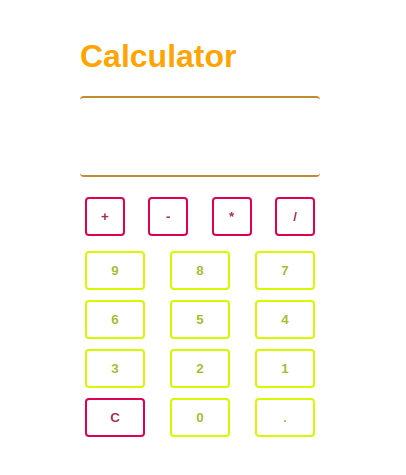

# Калькулятор. Часть 8. Немного красивостей.

В общем и целом, кнопки нам уже не нужны, но вдруг кто-нибудь забыл или не знает
как пользоваться калькулятором, так что мы оставим небольшую "подсказку".

[О вводе с клавиатуры](https://learn.javascript.ru/keyboard-events)

## Задача

Задача теперь состоит в том, чтобы "разукрасить" наш интерфейс.

Но это не всё - нужно убрать "Argument1", "Argument2", "Operation" и оставить
только поле "Result".

У меня получилось вот так:

